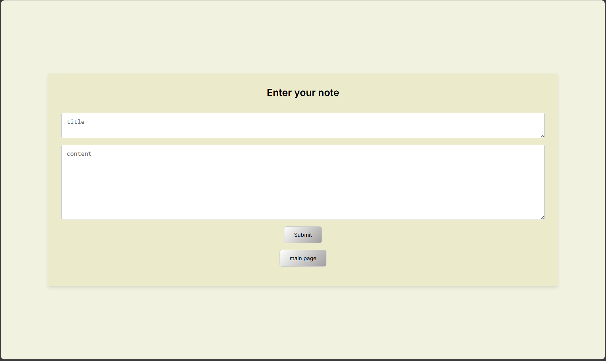
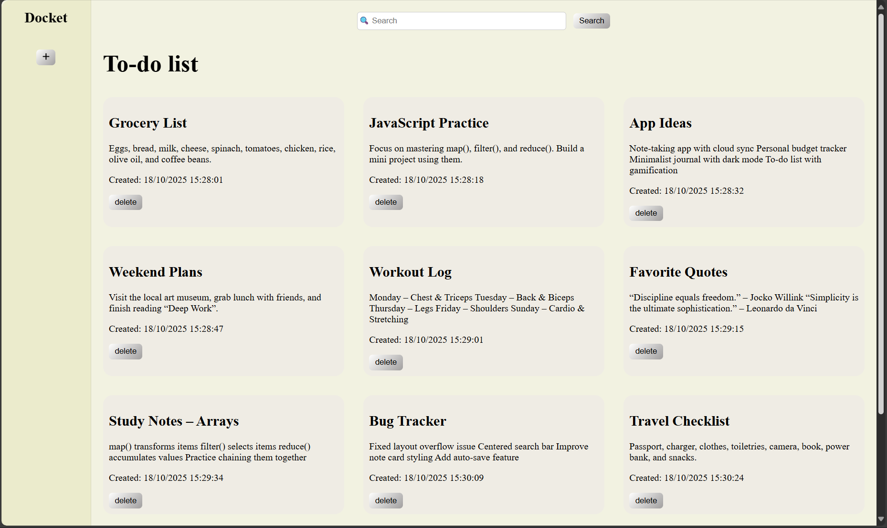

### 📝 To-Do List App : 

A lightweight, local-storage-based to-do list application built with HTML, CSS, and JavaScript.
It lets users create, search, display, and delete notes directly in the browser — no server required.

### UI Preview

| Add Note Page                                               | Notes Dashboard                                                        |
| ----------------------------------------------------------- | ---------------------------------------------------------------------- |
|  |  |


### Features

* Add notes with title and content

* Search notes dynamically by title

* Delete individual notes

*  Persistent storage via localStorage

* Two-page navigation

* index.html → main dashboard (list & search)

* formcreate.html → add new notes

* Automatic timestamps on note creation

* Responsive design with a clean, minimalist UI

###  Project Structure :

````

├── REAMDE.md               # Documentation
├── formcreate.html         # Note creation form
├── index.html              # Main dashboard page
├── pics
│   ├── dashboard.png
│   └── form.png
├── script.js               # Core logic 
├── stylesheet1.css         # Form styling
└── stylesheet2.css         # Dashboard styling 

````

###  How It Works : 

1. Create a Note

Open formcreate.html, enter a title and content, then click Submit.
Your note is automatically stored in the browser’s localStorage.

2. View & Manage Notes

Go back to index.html to see all your notes neatly displayed.
Each note shows:

Title

Content preview

Date/time of creation

Delete button

3. Search Notes

Use the search bar to filter notes by title in real-time.

### Technical Overview : 

| Area          | Description                                           |
| ------------- | ----------------------------------------------------- |
| **Frontend**  | Pure HTML5 + CSS3                                     |
| **Logic**     | Vanilla JavaScript (ES6)                              |
| **Storage**   | Browser `localStorage`                                |
| **UI Design** | Responsive grid layout, clean typography (Inter font) |
| **Icons**     | Font Awesome 6.5                                      |


### Setup & Usage

1. Clone the repository 

````
mkdir todo-list-app
cd todo-list-app
git clone https://github.com/Zidofski/To-do-list.git

````

2. Run locally

Just open index.html in your browser.

No installation or backend required.

3. Clear all notes (optional)

Open DevTools → Application → Local Storage → Delete notes key.


